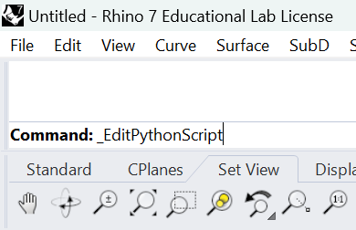

1) Type `_EditPythonScript` in the Rhino command line



2) Run the following code in the Python Editor

```python
import compas_fab
print(compas_fab)
```

3) All good if the code outputs the following:
```python
<module 'compas_fab' from 'C:\Users\marco\AppData\Roaming\McNeel\Rhinoceros\7.0\scripts\compas_fab\__init__.py'>
```