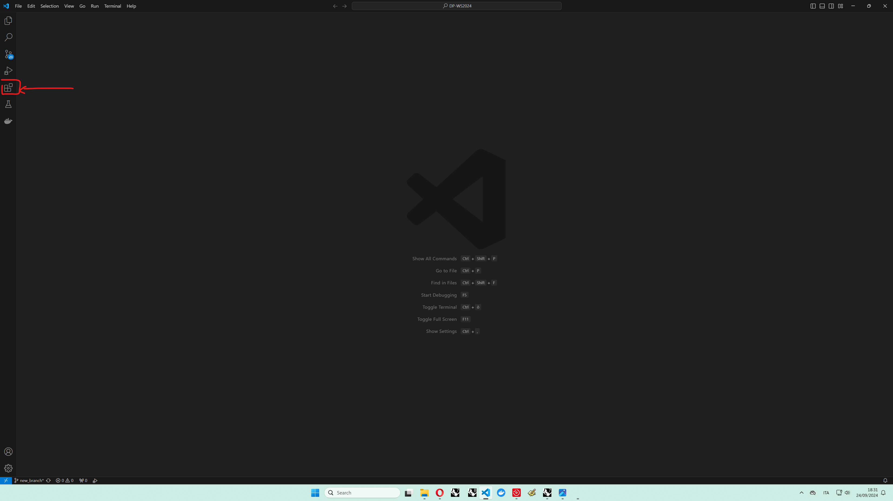
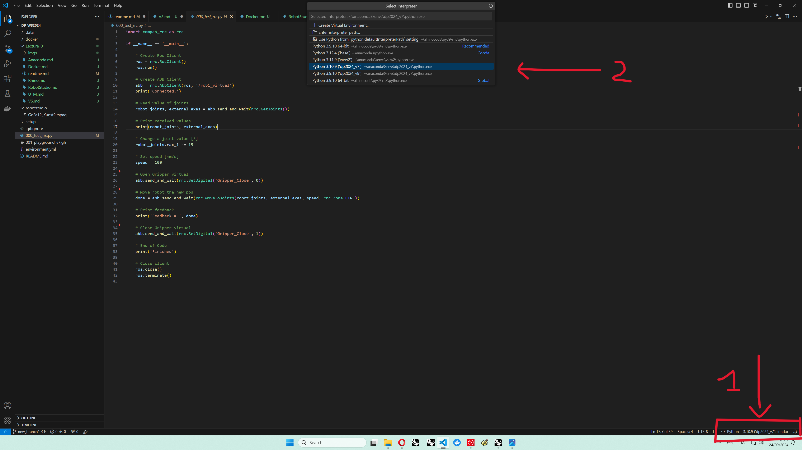

1. Open VS Code

2. Go to the `Extension` tab in the side bar

3. Search and install the following extension packages:
    * [Python](https://marketplace.visualstudio.com/items?itemName=ms-python.python)
    * [Docker](https://marketplace.visualstudio.com/items?itemName=ms-azuretools.vscode-docker)
    * [EditorConfig](https://marketplace.visualstudio.com/items?itemName=EditorConfig.EditorConfig)

4. In the top menu, go to `File`, click `Open Folder` and open this repository

5. Open the file `000_test_rcc.py`

6. Select the correct Python Interpreter `Python 3.10.9 dp2024`

