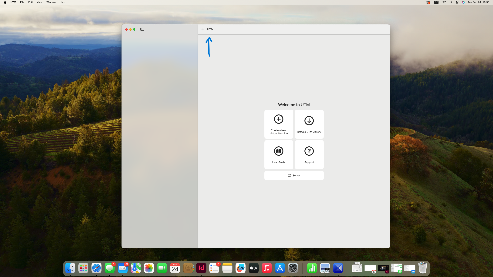
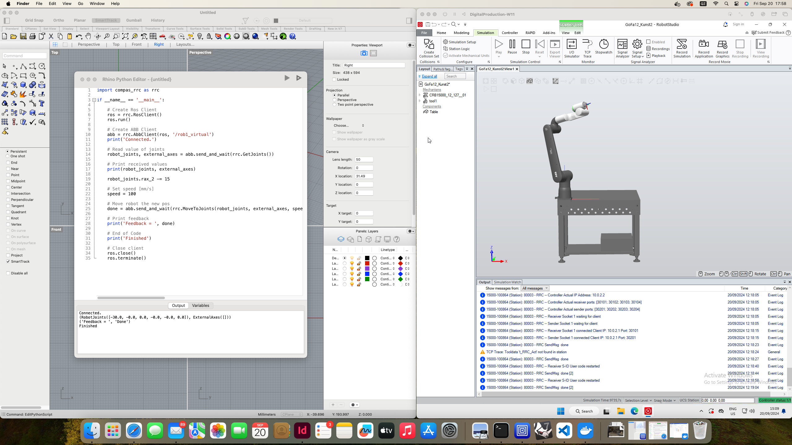

1. Open UTM

2. Click the `+` icon

3.Click `Open`

.png)

4.Open the `.utm` file 

.png)

5.Click the `settings` icon

.png)

6.Check `Information` settings

.png)

7.Check `System` settings

.png)

8.Check `QEMU` settings

.png)

9.Check `Network` settings - Tick `Show advanced settings` - Add `10.0.0.2` in the `Guest Network` field

.png)

10.Check `Display` settings 

.png)

11.Run `Windows Image` - Password is `DigitalProduction` - Open `RobotStudio`

